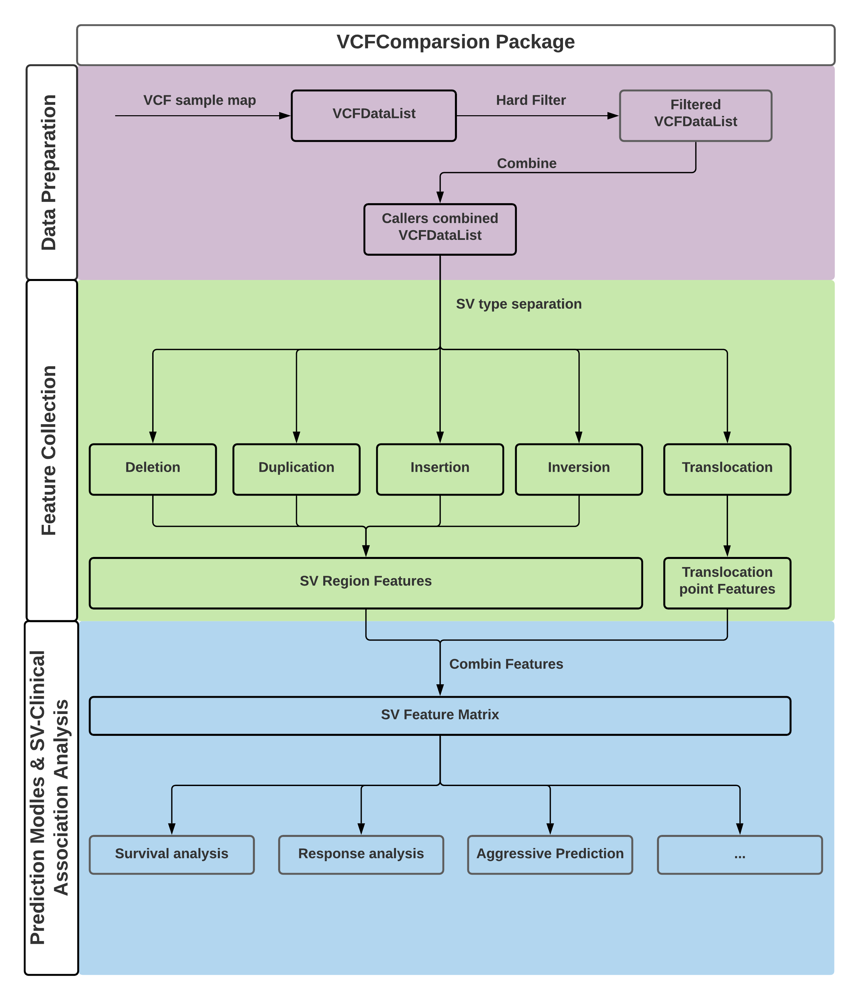

```{r setup, include=FALSE}
knitr::opts_chunk$set(echo = TRUE)
```

## Introduction
### Structure variation

Structure variants (SVs) are large genomic alterations which typically larger than 50 bp. Nowdays, multiple SV callers can detect the structure variation such as DELLY, Manta, GRIDSS, LUMPY etc @rausch2012delly, @chen2016manta, @cameron2017gridss, @layer2014lumpy. 

A common challenge of SV detection is the large false positive rate. Even each caller can provide the filter parameter to help users to filter the SV calls, we have concerns about the accuracy of the result from only one caller. Therefore, we need to apply the SV calling through multiple callers about combine the result to detect the most consistent calls among callers.

### Type of structure variation
In high-level, the structure variation can be divided into deletion, duplication, insertion, inversion and translocation. When we deal with the structure variation, translocation is the most different structure variation with the others. Deletion, duplication, insertion and inversion can be defined use a range on one chromosome but translocation is defined by two positions on different chromosomes. Therefore, in the VCFComparison, the methods applied on deletion, duplication, insertion and inversion are different with the methods applied on translocations. 


### Functions of VCFComparison
VCFComparison is a R package to help users combine the result from different caller and unify the calls then perform visualization on the detected SVs. Figure 1 shows the workflow of VCFComparison. Users can use VCFComparison package to (1) filter and combine the results from different callers; (2) Collect and summarize the SV features and (3) explore the association between SVs with clinical outcomes.   



## Section 1: Data Preparation
### 1.1 Sample map file

Usually, in a structure variation detection project, researchers apply multiple callers in same cohorts. Therefore, users need to provide sample mapping data frame to indecate the sample ID and the directory of different callers on different sample. Here we use two callers and two patients as an example. 

**VCFComparison works based on the individual .vcf file from each caller.**

We define the sample mapping data frame as follow: 

| Sample ID | Caller 1 | Caller 2 |
|----------------|-----------------------------------------------------------------------|-----------------------------
| patient_1 | '/user/caller1/1.vcf' | '/user/caller2/1.vcf'| 
| patient_2 | '/user/caller1/2.vcf' | '/user/caller2/2.vcf'| 

```{r eval= F}
sample_map <- data.frame(patient_ID = c("patient_1", "patient_2"), 
                         DELLY = c("/rhome/lyu062/shared/coh_SV/DELLY/output/tumor_vs_normal/filtered/post_filtered/M02.vcf", "/rhome/lyu062/shared/coh_SV/DELLY/output/tumor_vs_normal/filtered/post_filtered/M03.vcf"), 
                         Manta = c("/rhome/lyu062/shared/coh_SV/Manta/T_vs_N_somatic_SV/converted_INV/sample_2.vcf", "/rhome/lyu062/shared/coh_SV/Manta/T_vs_N_somatic_SV/converted_INV/sample_3.vcf"))

```

### 1.2 Read the vcf files into R. 

Based on the sample mapping file, we can read the vcf files into R use the function `Read_VCFs`. 

```{r eval = FALSE}
VCF_list <- Read_VCFs(sample_map)
```

### 1.3 Subtract the useful information from the VCF_list

There are three fields in a vcf file including meta, info and geno: 

[1] **meta** the head lines in the vcf. meta-information is included after the ## string and must be key=value pairs.

[2] **fix** is a table consisted by 6 columns: CHROM POS ID REF ALT QUAL FILTER INFO

[3] **gt** notes the genotype information for of each samples appears in the vcf. 

> **_NOTE:_** The detailed description about vcf files please check the wikipedia link: [Variant Call Format](https://en.wikipedia.org/wiki/Variant_Call_Format)


In the research, users might not need to use the whole information from a vcf file. Therefore, one can use the 

### 1.4 Filter the vcf files
The hard filter step is based on the parameter ("PASS" and "Precise") on each callers. Users can set the "PASS", "Precise" or "Both" to filter the SVs. In this example, we use Both criteria i.e. the calls should pass the read quality criteria and also have split reads support. The package provide the function `Hard_Filter` to perform the filter procedure. 

```{r eval = FALSE}
Filtered_VCF_List <- Hard_Filter(VCF_List, Filter_Standard = "Both")
```

### 1.5. Merging the callers results of samples
#### 1.5.1 Merging deletion, duplication, insertion and inversion. 
Once the data is filtered and we should merge the result from different callers into a unified SV dataframe. The most common used merging methods are union and intersection. Here we should give a mathematical definition of union and intersection of deletion, duplication, insertion and inversion. We can use a range interval to define any variation in deletion, duplication, insertion and inversion. $sv = [start, end]$. For one sample, one type of structure and one call, we can define a SV set as
$$SV_{[caller_i, SV\ type,\ patient_j]} = \{sv_1, sv_2, ...,sv_n\},$$
where $caller_i$ is one of the software researchers used when called the structure; $SV\ type \in \{deletion, duplication, insertion, inversion\}$; $patient_j$ is the $j^{th}$ patient in the cohort. 

> **_NOTE:_** there is no overlapping region in any two of $sv_1, sv_2, ..., sv_n$. 

**Union and intersection** operations on sv regions.

**Union and intersection** operation on SV sets. 

Once we define the SV set, then we can define the **union** and **intersection** operation of two sets. 


In VCFComparison, for deletion, duplication, insertion and inversion, the callers combining procedure is performed based on the union and intersection operation on the SV sets. Different from the ordinary union and intersection on whole callers, VCFComparison give the freedom to users that can select the dominant callers which provide the main result to keep the high accuracy. 

Here we use the deletion as an example to sure how the merge works. 
```{r eval=FALSE}


```

#### 1.5.2 Merging translocation

We can use two positions on different chromosome $(chromosome\ i, Position\ m)$ and $(chromosome\ j, Position\ n)$. 

##### 1.5.2.1 Windows based method


##### 1.5.2.2 Clustering based method


```{r eval = FALSE}


```

## Section 2: Data Preparation

## References

<div id="refs"></div>
