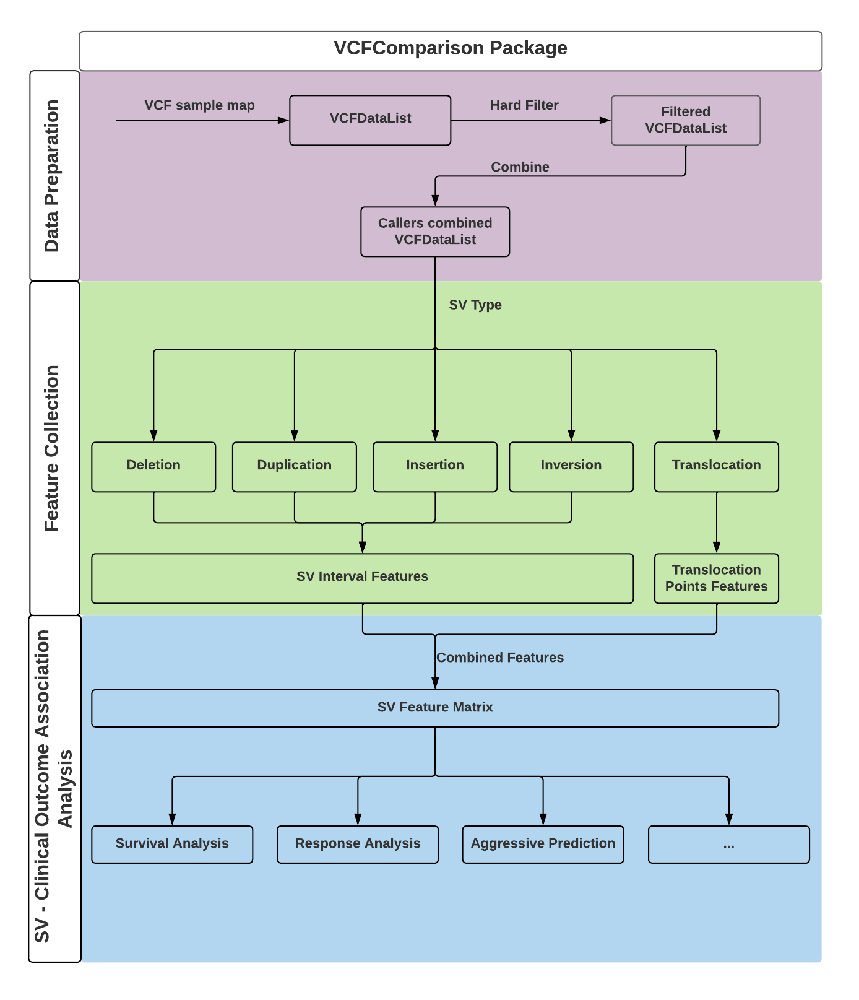
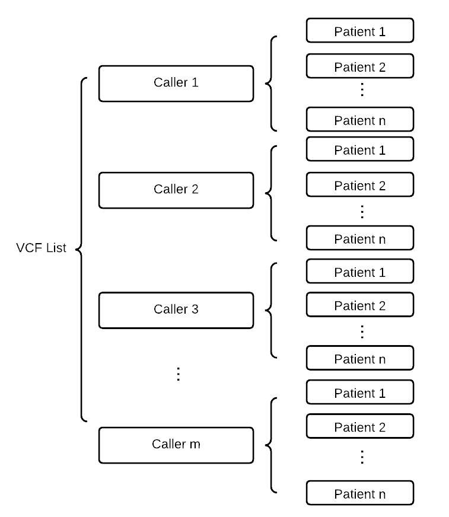
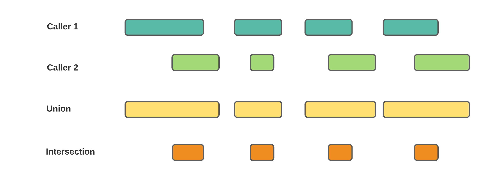
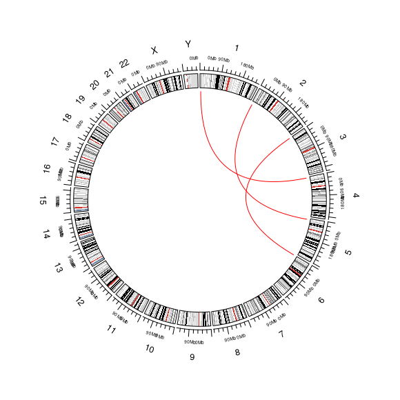
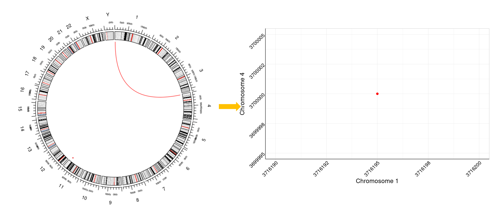
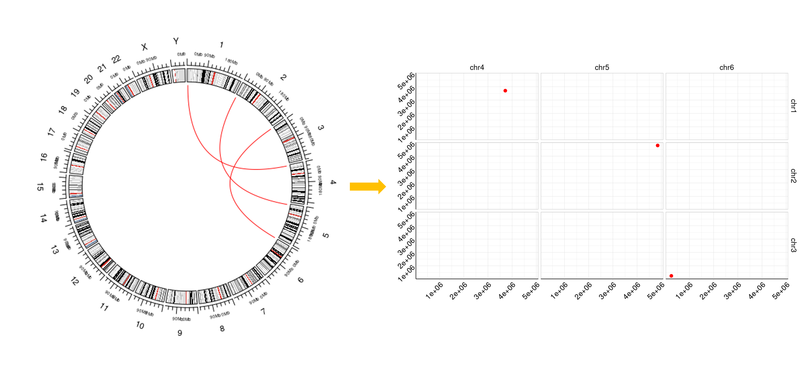

# Introduction

Whole genome sequencing (WGS) is a powerful tool for detecting structure variations (SV) in genomes. Typically, multiple SV callers are applied to a single patient's WGS data to increase the comprehensiveness of the results. However, there is currently a lack of tools to compare and merge the results from different callers. To address this issue, we have developed an R package called SVIV. This package enables users to manipulate SV results from different callers and identify the most confident structure mutations. Furthermore, we propose a projection method for complex translocations, which projects each translocation to a point on Cartesian coordinate system. This is followed by a clustering method to characterize the key translocation information and summarize the translocation mutations for the user. Overall, our approach provides a useful framework for analyzing SVs in WGS data.

## Install Package

To install this package, start R (version "4.2") and enter:

```{r eval = F}
library(devtools)
install_github("YULEITSINGTAO/SVIV")
```

A package only needs to be installed once. Load the package into an R session with

```{r eval = F}
library(SVIV)
```

## Structure variation

Structure variants (SVs) are large genomic alterations which typically larger than 50 bp. Nowdays, multiple SV callers can detect the structure variation such as DELLY (@rausch2012delly), Manta (@chen2016manta), GRIDSS (@cameron2017gridss), LUMPY (@layer2014lumpy), etc.

A common challenge of SV detection is the large false positive rate. Even each caller can provide the filter parameter to help users to filter the SV calls, we have concerns about the accuracy of the result from only one caller. Therefore, we need to apply the SV calling through multiple callers about combine the result to detect the most consistent calls among callers.

## Type of structure variation

In high-level, the structure variation can be divided into deletion, duplication, insertion, inversion and translocation. When we deal with the structure variation, translocation is the most different structure variation with the others. Deletion, duplication, insertion and inversion can be defined use a range on one chromosome but translocation is defined by two positions on different chromosomes. Therefore, in the SVIV, the methods applied on deletion, duplication, insertion and inversion are different with the methods applied on translocations.

## Functions of SVIV

SVIV is a R package to help users combine the result from different caller and unify the calls then perform visualization on the detected SVs. Figure 1 shows the workflow of SVIV. Users can use SVIV package to (1) filter and combine the results from different callers; (2) Collect and summarize the SV features and (3) explore the association between SVs with clinical outcomes. Figure 1 shows the workflow of SVIV.

```{r PackageWorkflow, fig.cap="Figure 1: The workflow of SVIV", echo=FALSE}

```

# Data Preparation

## Sample map file

Usually, in a structure variation detection project, researchers apply multiple callers in same cohorts. Therefore, users need to provide sample mapping data frame to indicate the sample ID and the directory of different callers on different sample. Here we use two callers and two patients as an example.

**SVIV works based on the individual .vcf file from each caller.**

We define the sample mapping data frame as follow:

```{r eval= F}
sample_map <- data.frame(patient_ID = c("Sample_1", "Sample_2"), 
                         caller1 = c("/user/caller1/sample_1.vcf", 
                                     "/user/caller1/sample_2.vcf"), 
                         caller2 = c("/user/caller2/sample_1.vcf", 
                                     "/user/caller2/sample_1.vcf"))

```

| Sample ID | Caller 1                     | Caller 2                     |
|-----------|------------------------------|------------------------------|
| Sample_1  | '/user/caller1/sample_1.vcf' | '/user/caller2/sample_1.vcf' |
| Sample_2  | '/user/caller1/sample_1.vcf' | '/user/caller2/sample_2.vcf' |

## Read the vcf files into R.

Based on the sample mapping file, we can read the vcf files into R use the function `Read_VCFs`.

```{r eval = FALSE}
VCF_List <- Read_VCFs(sample_map)
```

VCF List is the basic data type in this package. In a VCF List, it contents all of the partient SV results called by the provided callers. Figure \@ref(fig:str) shows the structure of the VCF list data type.

```{r str, echo=FALSE, fig.cap="Strucure of VCF List.", echo=FALSE}

```

## Subtract the useful information from the VCF_list

The basic cell of VCF_List is VCF file, we here we provide a brief introduction about VCF file.

There are three fields in a vcf file including meta, info and geno:

[1] **meta** the head lines in the vcf. meta-information is included after the \## string and must be key=value pairs.

[2] **fix** is a table consisted by 6 columns: CHROM POS ID REF ALT QUAL FILTER INFO

[3] **gt** notes the genotype information for of each samples appears in the vcf.

***NOTE:*** The detailed description about vcf files please check the wikipedia link: [Variant Call Format](https://en.wikipedia.org/wiki/Variant_Call_Format)

## Filter the vcf files

In general case, the caller put the filter infromation in the VCF file to note the confidence of the SV event. To avoid low confident result introduced into the analysis workflow, the first step is to filter the VCF files (i.e. VCF_List). The hard filter step is based on the parameter ("PASS" and "Precise") on each callers. Users can set the "PASS", "Precise" or "Both" to filter the SVs. In this example, we use Both criteria i.e. the calls should pass the read quality criteria and also have split reads support. The package provide the function `hardFilter` to perform the filter procedure.

```{r eval = FALSE}
Filtered_VCF_List <- hardFilter(VCF_List, Filter_Standard = "Both")
```

## Extract the SV by type

In this package, we define the structure variation in 5 types which are deletion ("DEL"), duplication ("DUP"), insertion ("INS"), inversion ("INV") and translocation ("TRANS"). In most of the cases, each type of the structure variation is analysised seperately. Therefore, we extract the SV by type conducted by `SVtypeList()`

```{r eval = FALSE}
Deletion_List <- SVtypeList(Filtered_VCF_List, "DEL")
Duplication_List <- SVtypeList(Filtered_VCF_List, "DUP")
Insertion_List <- SVtypeList(Filtered_VCF_List, "INS")
Inversion_List <- SVtypeList(Filtered_VCF_List, "INV")
Trans_List <- SVtypeList(Filtered_VCF_List, "TRANS")
```

## Merging the callers results of samples

### Merging deletion, duplication, insertion and inversion.

Once the data is filtered and we should merge the result from different callers into a unified SV dataframe. The most common used merging methods are union and intersection. Here we give a mathematical definition of union and intersection of deletion, duplication, insertion and inversion.

We can use a range interval to define any variation in deletion, duplication, insertion and inversion. $sv = [start, end]$. For one sample, one type of structure and one call, we can define a SV set as $$SV_{[\textrm{caller}_i, \textrm{type},\textrm{sample}_j]} = \{\textrm{sv}_1, \textrm{sv}_2, ...,\textrm{sv}_n\},$$

where

-   $\textrm{caller}_i$ is one of the software researchers used when called the structure;

-   $\textrm{type} \in \{\textrm{deletion}, \textrm{duplication}, \textrm{insertion}, \textrm{inversion}\}$;

-   $\textrm{sample}_j$ is the $j^{th}$ patient in the cohort.

Once we define the SV set, then we can define the **union** and **intersection** operation of two sets. Figure \@ref(fig:DefinitionOfUnionAndIntersection)

```{r DefinitionOfUnionAndIntersection, fig.cap="Definition of union and intersection.", echo=FALSE}

```

In SVIV, for deletion, duplication, insertion and inversion, the callers combining procedure is performed based on the union and intersection operation on the SV sets. Different from the ordinary union and intersection on whole callers, SVIV give the freedom to users that can select the dominant callers which provide the main result to keep the high accuracy.

Here we use the deletion as an example to sure how the merge works. Caller names were use as  

```{r eval=FALSE}
Deletion_caller1_List <- Deletion_List$caller1
Deletion_caller2_List <- Deletion_List$caller2
```

In SVIV, we defined two operation which are intersection (%I%) and union (%U%). Users can use these two operations to merge the result. 

```{r eval=FALSE}
Deletion_caller1_List %U% Deletion_caller2_List

Deletion_caller1_List %I% Deletion_caller2_List
```

### Merging translocation

#### Ways to define translocations

A translocation corresponding to two break ends on different chromosomes. We can use $(\textrm{Chromosome}\ i, \textrm{Position}\ m)$ and $(\textrm{Chromosome}\ j, \textrm{Position}\ n)$ to represent two break ends. Therefore, for a translocation event, two break points are detected. For example

```{r}
Simulated_translocation_bed <- readRDS("../inst/extdata/simulated_translocation.rds")
Simulated_translocation_bed
```

We can use a circos plot to represent four translocations in Figure \@ref(fig:TranslocationCircosExample)

```{r TranslocationCircosExample, fig.cap="Translocation.", echo=FALSE}

```

Additionally, we we use a other way to define the translocation. For a given translocation, $(\textrm{Chromosome}\ i, \textrm{Position}\ m); (\textrm{Chromosome}\ j, \textrm{Position}\ n)$, we can construct a x-y axis which x axis represents the positions on $\textrm{Chromosome}\ i$ and y axis represents the position on $\textrm{Chromsome}\ j$. Then every translocation can be represented as a scatter on the x-y coordinate.

```{r CircosTranslocationProjection, fig.cap="Translocation projection.", echo=FALSE}

```

Each translocation on in the .vcf file can be project to the x-y coordiante.

```{r GenomeTranslocationProjection, fig.cap="Genome Translocation Projection.", echo=FALSE}

```

For a translocation, it is a challenging work to merge the translocation from different callers because the translocation inclduding two break ends and that makes it be different from merging the range structure variants.

Here we provide two ways to merge the translocation.

#### Clustering based method
Since translocation is a type of large scale 

# Structure variation visulization


# References {.unnumbered}

::: {#refs}
:::

# Session info {.unnumbered}

```{r sessionInfo, echo=FALSE}
sessionInfo()
```
